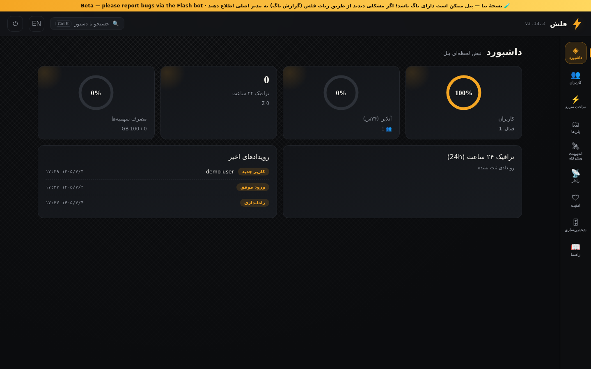
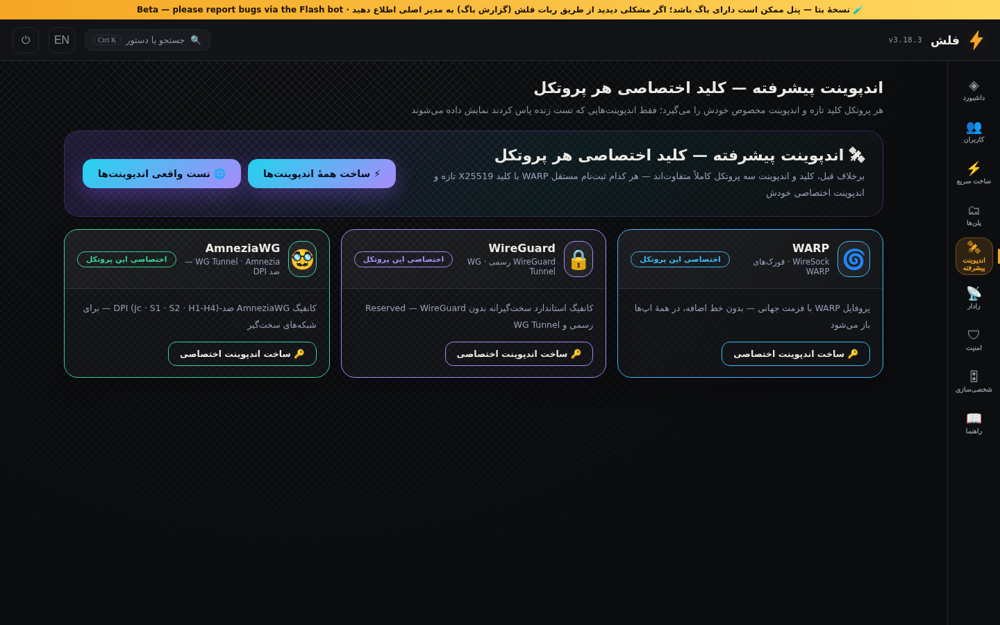
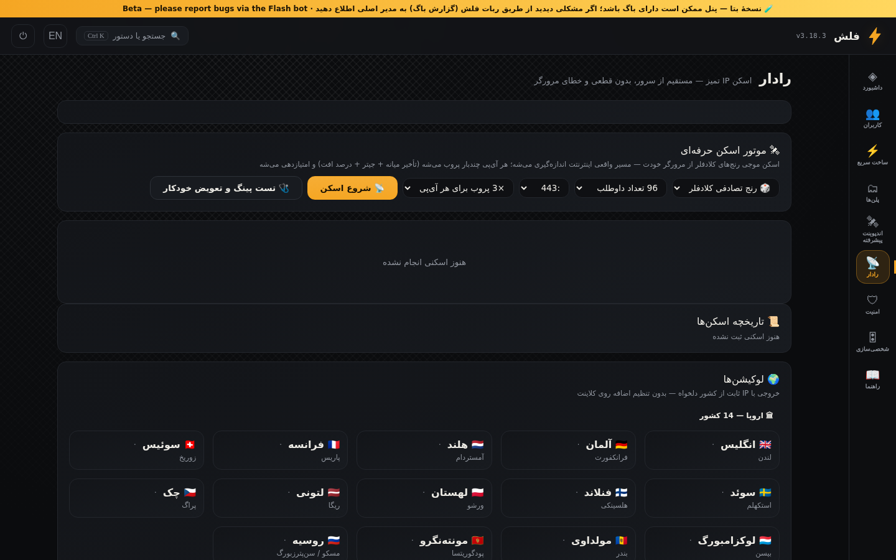
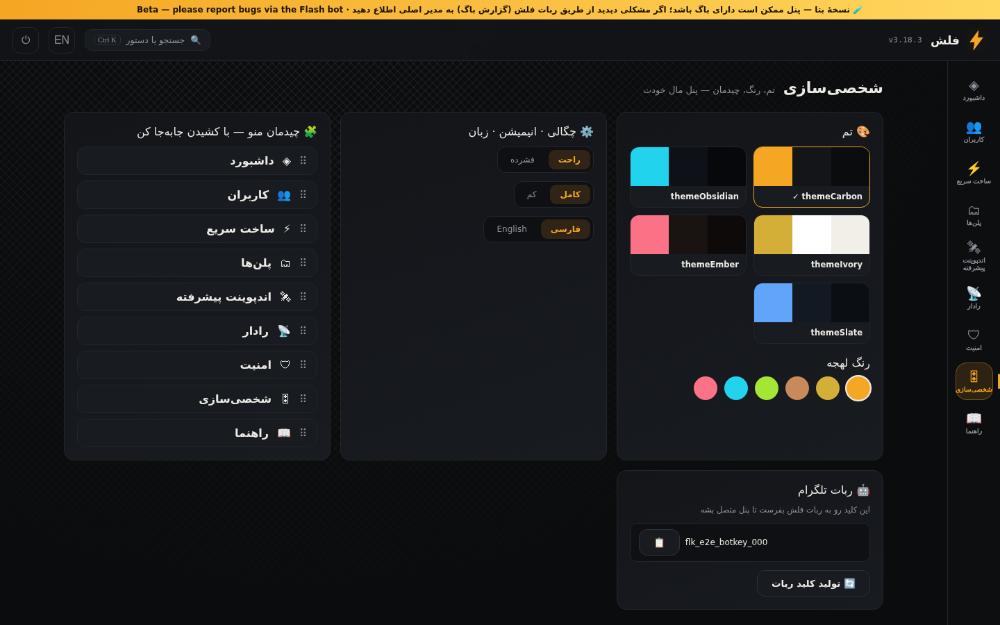
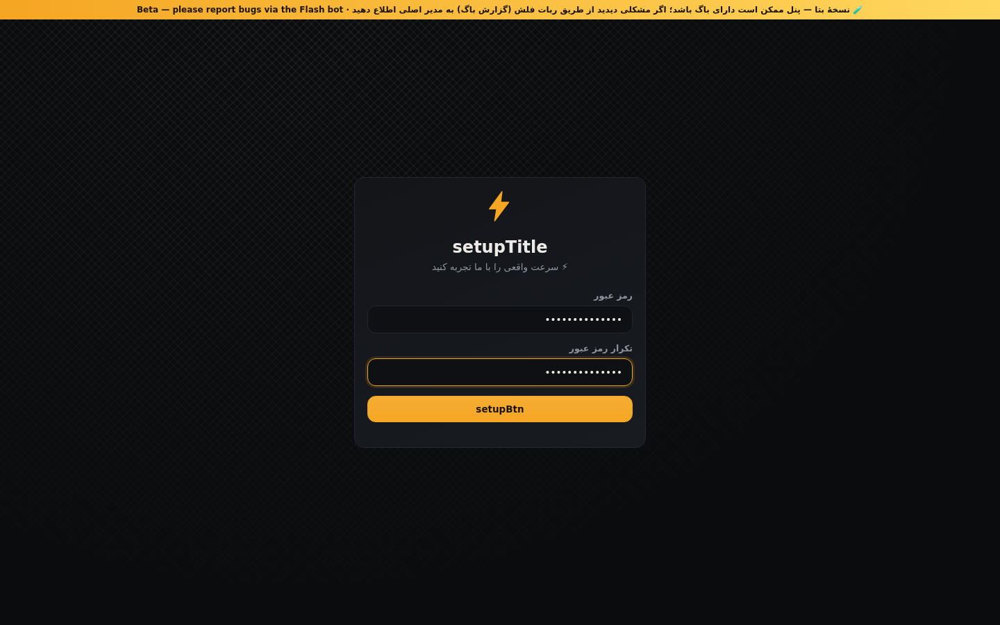
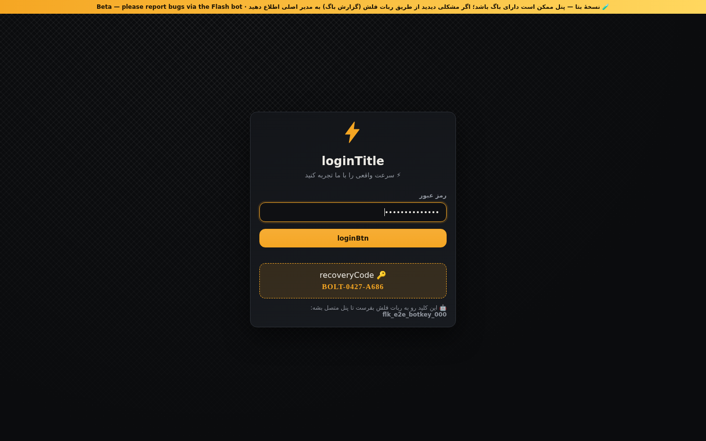
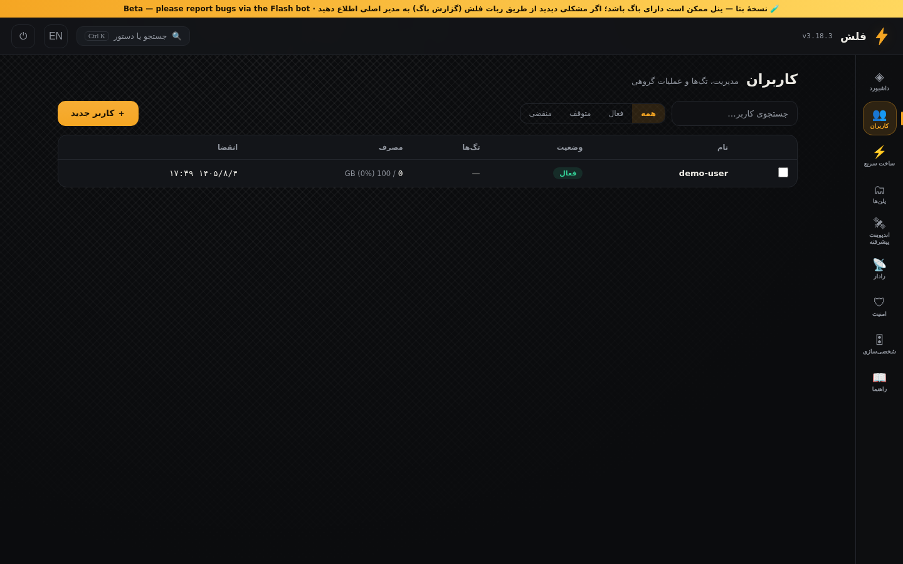
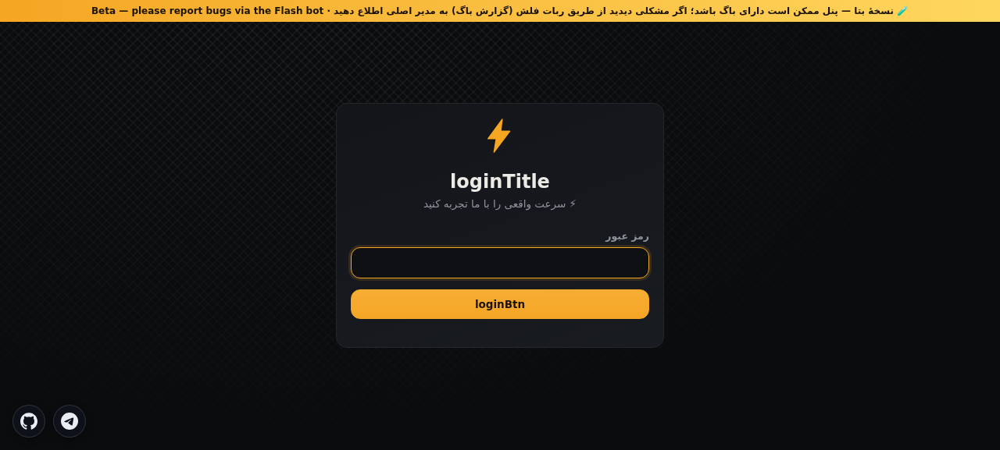

<div align="center">


# ⚡ FLASH PANEL

**The modern self-hosted proxy panel on Cloudflare Workers + D1 — free forever, zero servers.**


[](https://workers.cloudflare.com/)
[](https://developers.cloudflare.com/d1/)
[](https://t.me/Mohamadaghilibot)
[](https://github.com/Mohamad-1385/FlashPanel/releases)
[](LICENSE)

[فارسی 🇮🇷](#-فارسی) · [English 🇬🇧](#-english)

</div>

---

## 🇬🇧 English

**FLASH Panel** turns a free Cloudflare account into a full-featured personal proxy server: multi-protocol configs (VLESS / VMess / Trojan / Shadowsocks — WS, XHTTP & gRPC transports), 25+ country exit locations, an advanced WARP endpoint engine, a live radar scanner, and a Telegram bot that manages everything from your pocket — all in **one single Worker file + one D1 database**, no VPS needed.

### ✨ Highlights

**🚀 NEW in v7.9.29 — Mega Speed Engine:** relays ranked by *measured real throughput* (Mbps) instead of TCP-milliseconds. Live-measured through the tunnel: Italy **145** / Germany **241** / flagless **145 Mbps** on Cloudflare-hosted sites (was ~16), 268 Mbps / 571 peak direct egress, 4-parallel browser load: 35MB in **1.8s**. Gemini on flagless configs verified on all 4 panels.

| | Feature | What you get |
|---|---|---|
| 🚀 | **One-file deploy** | A single `flash-panel-worker.js` (~1 MB) + D1 — deploys in under 2 minutes |
| 🔐 | **6 protocols** | VLESS · Trojan · Shadowsocks · VMess · VLESS-XHTTP · VMESS-gRPC (ws/grpc) |
| 🌍 | **25+ country exits** | 🇺🇸 US · 🇬🇧 UK · 🇩🇪 DE · 🇳🇱 NL · 🇹🇷 TR · 🇦🇪 UAE · 🇸🇬 SG · 🇯🇵 JP and more, with live relay health-checks |
| 🌀 | **WARP endpoint engine** | 155 official endpoints (43 engage ports + 28 Cloudflare IPs × 4 ports) · two-phase live scanner (29 hosts × 22 ports) · WARP / WireGuard / AmneziaWG config builder |
| 📡 | **Radar & IP scanner** | Scan Cloudflare ranges for the fastest front IPs — presets for Irancell / MCI / Rightel / TCI / Gaming / **AI (Gemini)** |
| 🤖 | **Telegram bot** | Create panels, manage users, quick-create configs, relay ping tests, world-relay discovery, AI assistant — right from Telegram |
| 🎨 | **8 themes + glass mode** | AMOLED, Carbon, Ember, Ivory, Obsidian, Slate and more · full RTL + English UI |
| 🛡 | **GHOST stealth** | Gate-protected panel, decoy site for strangers, ad/tracker blocking at the core |
| ⚡ | **Flash transfer engine** | Coalesced frames + backpressure (HWM 768 KB) + informed-kill guard — sustained transfers without stalls |
| 🆓 | **Free tier friendly** | Runs entirely on Cloudflare's free plan — D1 writes reduced ~86% by design |

### 📸 Screenshots

| Dashboard | Advanced endpoints (WARP) |
|---|---|
|  |  |

| Radar & locations | Themes |
|---|---|
|  |  |

<details>
<summary>More screenshots</summary>

| Setup | Login | Users |
|---|---|---|
|  |  |  |

| Social links (Telegram + GitHub on every page) |
|---|
|  |

</details>

### 🚀 Quick Start

```bash
# 1 · clone
git clone https://github.com/Mohamad-1385/FlashPanel.git
cd FlashPanel

# 2 · deploy (needs a free Cloudflare account; wrangler will ask for login)
npx wrangler deploy

# 3 · open your panel
#    https://<your-worker>.<your-subdomain>.workers.dev  →  first visit sets your admin password
```

**Step 2 in detail** — create the D1 database and bind it:

```bash
npx wrangler d1 create flash-db      # copy the printed database_id into wrangler.toml
npx wrangler d1 execute flash-db --file=src/schema.sql   # (optional — the worker self-creates tables)
npx wrangler deploy
```

Then optionally connect the **Flash Telegram bot** → [t.me/Mohamadaghilibot](https://t.me/Mohamadaghilibot) — send your panel URL and the bot takes over: user management, updates, backups, relay tests, and one-tap config delivery.

<details>
<summary>🔧 Manual deploy without git (3 minutes)</summary>

1. Copy `flash-panel-worker.js` into a new Cloudflare Worker (dashboard → Workers → Create).
2. Create a D1 database, bind it as `DB`.
3. Set a secret `GATE` (your private gate path) — the panel only opens at `/m/<GATE>`.
4. Save & visit `https://<worker>.workers.dev/m/<GATE>`.

</details>

### 📱 Supported clients

v2rayNG · Hiddify · Happ · sing-box · v2rayN · NekoBox · Clash Meta · WireSock (WARP configs) — every generated subscription works out of the box, with per-app QR codes and one-tap import links.

### ❓ FAQ

- **Does Gemini work?** Yes — pick front IPs from the **🤖 AI (Gemini)** radar preset (104.16–104.19 ranges) and a US/UK exit. Verified: `gemini.google.com` → `HTTP 200`.
- **Telegram calls?** Telegram's TURN-over-TCP relays traverse the tunnel cleanly; non-DNS UDP is instantly refused so clients fall back fast (no more eternal “connecting…”).
- **Is it free?** The whole stack runs on Cloudflare's free tier. No VPS, no domain required.

### ⚠️ License — please read

This repository is **source-available, NOT open-source**. See [LICENSE](LICENSE). You may deploy and use it for **personal, non-commercial** purposes. Copying, modifying, redistributing, re-publishing or selling the code — in whole or in part — is **prohibited**.

---

## 🇮🇷 فارسی

**پنل فلش** یک حساب رایگان کلادفلر را به یک سرور پروکسی کامل شخصی تبدیل می‌کند: کانفیگ‌های چند-پروتکله (VLESS / VMess / Trojan / Shadowsocks با ترنسپورت‌های WS و XHTTP و gRPC)، خروجی ۲۵+ کشور، موتور اندپوینت WARP، اسکنر رادار زنده و یک ربات تلگرام که همه‌چیز را از جیب شما مدیریت می‌کند — همه در **یک فایل ورکر + یک دیتابیس D1**، بدون نیاز به سرور.

### ✨ امکانات کلیدی

- 🚀 **استقرار تک-فایلی** — یک فایل `flash-panel-worker.js` + D1؛ زیر ۲ دقیقه آماده است
- 🔐 **۶ پروتکل** — VLESS · Trojan · Shadowsocks · VMess · XHTTP · gRPC
- 🌍 **خروجی ۲۵+ کشور** — آمریکا، انگلیس، آلمان، هلند، ترکیه، امارات، سنگاپور، ژاپن و… با تست سلامت زندهٔ رله‌ها
- 🌀 **موتور اندپوینت WARP** — ۱۵۵ اندپوینت رسمی (۴۳ پورت engage + ۲۸ IP کلادفلر × ۴ پورت) · اسکنر زندهٔ دو-فازی (۲۹ هاست × ۲۲ پورت) · ساخت کانفیگ WARP / WireGuard / AmneziaWG
- 📡 **رادار و اسکنر IP** — اسکن رنج‌های کلادفلر برای سریع‌ترین IPها — پیش‌تنظیم‌های ایرانسل / همراه‌اول / رایتل / مخابرات / گیمینگ / **هوش مصنوعی (جمنای)**
- 🤖 **ربات تلگرام** — ساخت پنل، مدیریت کاربر، ساخت سریع کانفیگ، تست پینگ رله‌ها، جستجوی رلهٔ جهان، دستیار هوشمند
- 🎨 **۸ تم + حالت شیشه‌ای** — AMOLED، کربن، یاقوت، عاج و… · رابط کامل فارسی و انگلیسی
- 🛡 **محافظت GHOST** — پنل پشت گیت مخفی، سایت نمایشی برای غریبه‌ها، مسدودسازی تبلیغات در هسته
- ⚡ **موتور انتقال فلش** — ادغام فریم‌ها + فشار-برگشتی + گارد بااطلاع — انتقال پایدار بدون انجماد
- 🆓 **کاملاً رایگان** — روی پلن رایگان کلادفلر اجرا می‌شود (نوشتن‌های D1 تا ۸۶٪ کاهش یافته)

### 📸 تصاویر

| داشبورد | اندپوینت پیشرفته (WARP) |
|---|---|
|  |  |

### 🚀 نصب سریع

```bash
# ۱ · دریافت پروژه
git clone https://github.com/Mohamad-1385/FlashPanel.git
cd FlashPanel

# ۲ · ساخت دیتابیس و اتصال آن (دیتابیس آیدی چاپ‌شده را در wrangler.toml بگذارید)
npx wrangler d1 create flash-db

# ۳ · دیپلوی
npx wrangler deploy

# ۴ · پنل: https://<your-worker>.<your-subdomain>.workers.dev/m/<GATE>
```

راهنمای کامل فارسی: [docs/INSTALL-FA.md](docs/INSTALL-FA.md) · معرفی ربات: [docs/BOT-FA.md](docs/BOT-FA.md)

### ❓ پرسش‌های پرتکرار

- **جمنای باز می‌شود؟** بله — IP ورودی از گروه «🤖 هوش مصنوعی» رادار (رنج‌های 104.16–104.19) + خروجی آمریکا/انگلیس. تست واقعی: `gemini.google.com` → `HTTP 200` ✓
- **تماس تلگرام؟** رله‌های TURN-over-TCP تلگرام از تونل عبور می‌کنند؛ UDP غیر-DNS فوراً رد می‌شود تا کلاینت سریع fallback کند (پایان «درحال اتصال» ابدی).
- **هزینه؟** کل سامانه روی پلن رایگان کلادفلر — بدون سرور، بدون دامنه.

### ⚠️ مجوز — لطفاً بخوانید

این مخزن **قابل‌مشاهده است، نه متن‌باز**. مجوز [LICENSE](LICENSE) فقط استقرار و استفادهٔ **شخصی و غیرتجاری** را می‌دهد. کپی، تغییر، بازنشر یا فروش کد — کل یا بخشی از آن — **ممنوع است**.

---

<div align="center">

**⚡ FLASH PANEL** · built & maintained by [Mohamad-1385](https://github.com/Mohamad-1385)

🤖 Bot: [@Mohamadaghilibot](https://t.me/Mohamadaghilibot)

</div>
