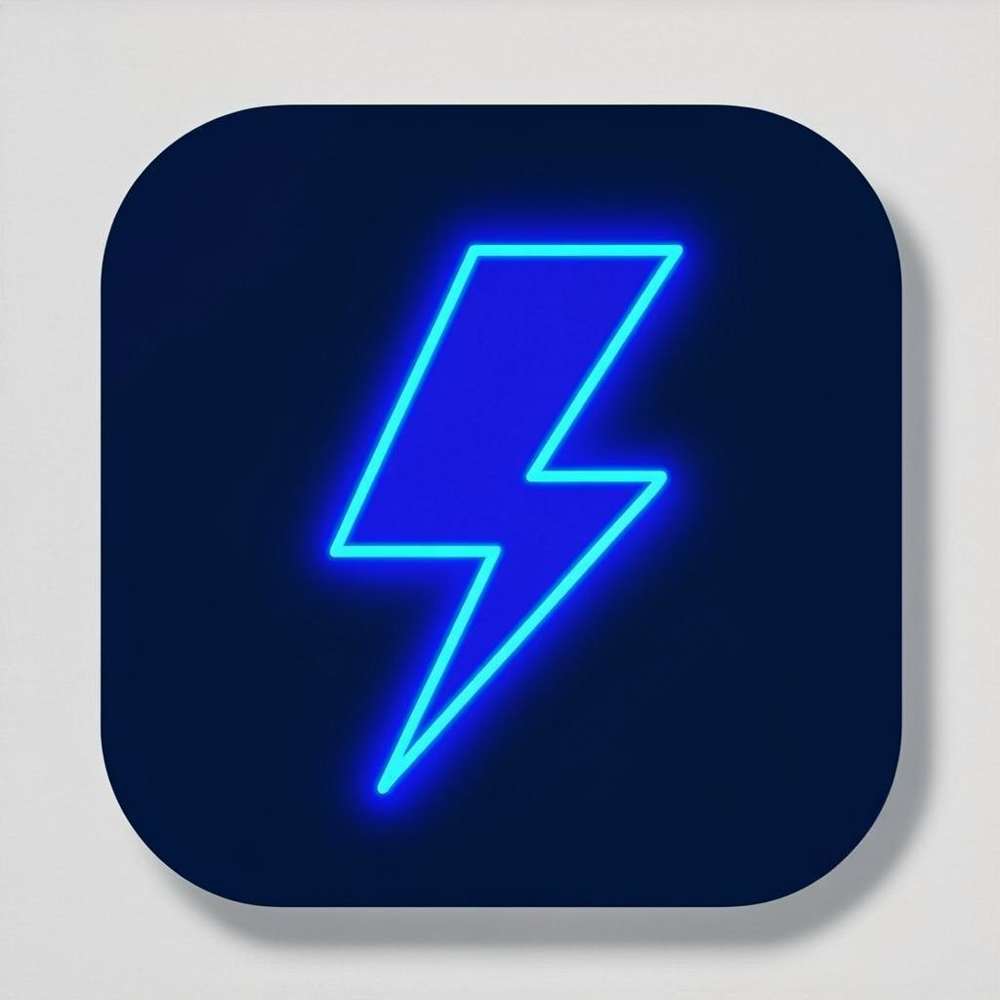

# ⚡ پنل فلش

**مدرن‌ترین پنل پروکسی خودمیزبان روی کلادفلر ورکر + D1 — همیشه رایگان، بدون نیاز به سرور.**

[English 🇬🇧](README.md)

---

## ✨ فلش چیست؟

پنل فلش یک حساب رایگان کلادفلر را به یک سرور پروکسی کامل شخصی تبدیل می‌کند: کانفیگ‌های چندپروتکله (VLESS / Trojan / Shadowsocks / VMess)، خروجی ۲۵+ کشور، موتور اندپوینت WARP با ۱۵۵ اندپوینت رسمی، رادار و اسکنر آی‌پی زنده، حالت پنهان‌کاری گوست، ربات تلگرام با دستیار هوشمند — همه در **یک فایل ورکر + یک دیتابیس D1**.

## 🚀 نصب سریع (۲ دقیقه)

1. فایل `flash-panel-worker.js` را از [آخرین ریلیز](https://github.com/Mohamad-1385/FlashPanel/releases/latest) دانلود کنید
2. در کلادفلر یک Worker بسازید و محتوای فایل را در آن قرار دهید
3. یک دیتابیس D1 بسازید و به ورکر وصل کنید (راهنمای کامل: [docs/INSTALL-FA.md](docs/INSTALL-FA.md))
4. آدرس ورکر را باز کنید و رمز مدیر را بسازید — تمام! ✅

## 🌟 قابلیت‌های انحصاری

| | قابلیت | توضیح |
|---|---|---|
| 🔬 | موتور رودبار + موشک | مسیرهای تست‌شدهٔ هوشمند برای هر سرویس |
| 📡 | ۱۵۵ اندپوینت رسمی WARP | ۴۳ پورت engage + ۲۸ آی‌پی کلادفلر × ۴ پورت |
| 🛡 | حالت شبح (GHOST) | پنل برای غریبه‌ها یک سایت عادی است |
| 🤖 | ربات تلگرام + دستیار هوشمند | مدیریت کامل از جیب شما |
| 🎨 | ۸ تم + حالت شیشه‌ای | کاملاً راست‌چین + انگلیسی |

## 📚 مستندات

- [راهنمای نصب فارسی](docs/INSTALL-FA.md)
- [معرفی ربات فلش](docs/BOT-FA.md)
- [تاریخچهٔ نسخه‌ها](RELEASE.md)

## ⚖️ مجوز

استفادهٔ شخصی آزاد است — کپی، تغییر، بازنشر و فروش ممنوع ([LICENSE](LICENSE)).
